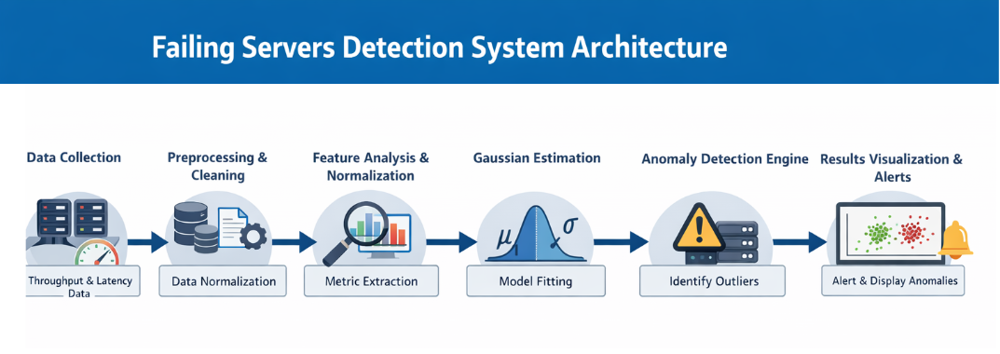
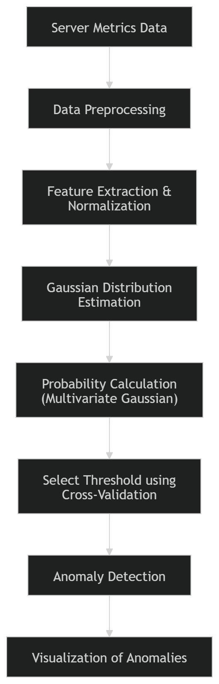
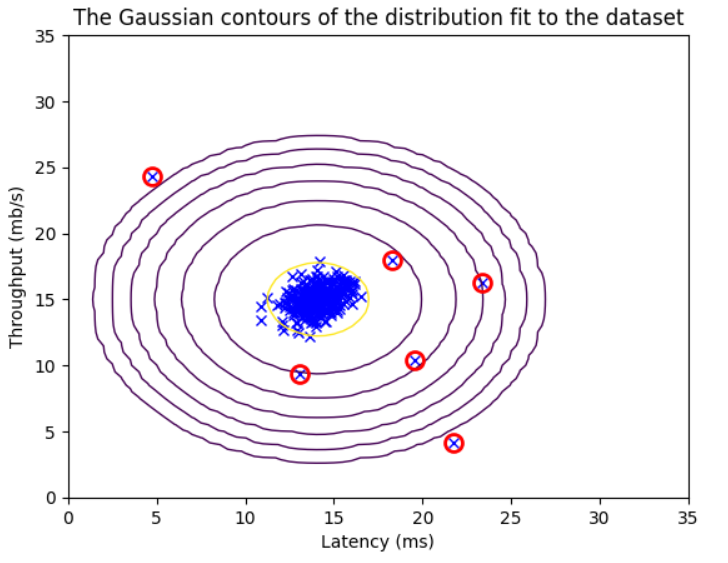

# Failing Servers Detection System Using Anomaly Detection 🚨

This project implements an anomaly detection system to identify failing servers in a network by analyzing throughput and latency metrics. It uses a Gaussian-based statistical model(anomaly detection model) to detect anomalies that indicate server failures.

---

## Problem Statement

In large-scale networks, failing servers can cause downtime, degraded performance, and user dissatisfaction. Detecting failures proactively is critical to maintain service reliability.  

**Challenges:**
- Manual monitoring is inefficient for large networks.
- Server metrics may vary naturally, making it difficult to detect anomalies.
- Early detection requires accurate identification of unusual patterns in real-time data.

**Goal:** Automatically identify servers exhibiting anomalous behavior using historical server metrics.

---

## Solution Overview

The system applies a multivariate Gaussian model to learn normal behavior of server metrics (throughput and latency). Anomalies are detected as points that deviate significantly from this learned distribution.  

**🔹 System Architecture**

**🔹 Machine Learning Pipeline**

**Pipeline Description:**
1. **Data Collection:** Collect server performance metrics (throughput and latency).
2. **Data Preprocessing:** Normalize metrics and split into training and validation sets.
3. **Gaussian Parameter Estimation:** Estimate mean and variance for each metric to model normal behavior.
4. **Anomaly Detection:** Identify servers with metrics having low probability under the Gaussian model.
5. **Threshold Selection:** Use cross-validation to select the optimal probability threshold (epsilon) for classifying anomalies.
6. **Visualization:** Highlight detected anomalies in scatter plots for easy inspection.

   

---

## Tech Stack

Python | Numpy | Matplotlib | Pandas | Scikit-learn | Seaborn | Jupyter Notebook

---

